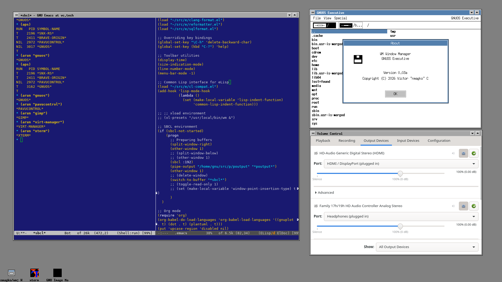
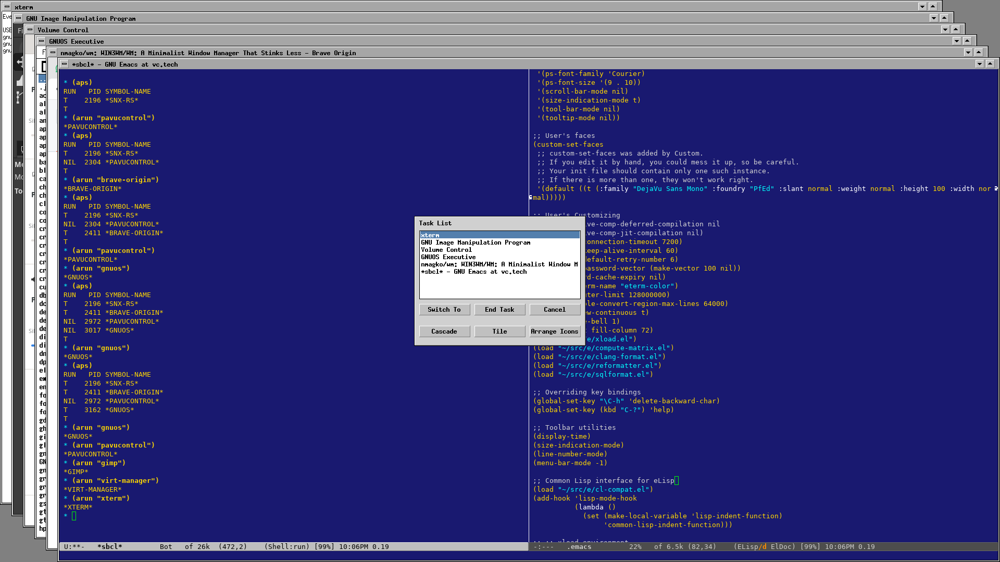
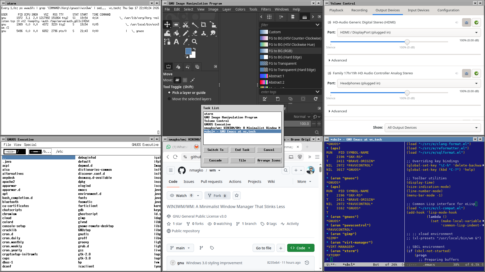

## WIN3WM/WM: A Minimalist Window Manager That Stinks Less

### Description

This is a stinkless, high-speed, and very compact window manager. It has
two styles: X basic and Windows 3.0. It has been designed to use low CPU
and RAM resources, between 3 and 4 MB of RAM (yeah, megabytes), not just
for low-resource hardware, but because I strongly think that software
has to be simple and minimal. Nowadays, most of the window managers have
too many features; in my experience, features that I've never used.

### Extra context

I made this software in 2018, and the idea was to use xterm or emacs as
a program manager; currently, I use emacs as the program manager. I've
decided to code a program manager for the Windows 3.0-style version,
respecting the essence of the Windows 3.0 program manager. It's probably
going to take some time. I will code it in my free time. And in the
future, perhaps I'm going to include an OS/2 2.11 style because it is
very similar to the Windows 3.0 style, object distribution, and
behavior. And always minimalistic, keeping the goal of low resource
consumption.

### Files

  Makefile: highly advanced build system

  wm.c: X basic-style window manager code (insanely minimalistic)

  win3wm.c: Windows 3.0-style window manager code (minimal with title
  bar, action buttons, and task list)

  win.c: Windows 3.0-style launcher and first-time setup

### Prerequisites

Xorg, Xorg development packages, xterm, xrandr utility, and sysv-rc. The
sysv-rc-conf utility is recommended. Emacs is optional in case you wanna
use it as a program manager.

Additionally, it is recommended to use a runlevel without X in text
mode; the X basic-style is launched with startx, and the Windows
3.0-style is launched with the win command.

### Compile

```sh
make
```

### Install

The programs will be installed in the /usr/local/bin directory

```sh
sudo make install
```

### Preparation

If you are using Slackware, change in the /etc/inittab file the runlevel
to 3. Runlevel 3 is meant for multi-user, text-console mode without
starting a display manager.

If you are using Devuan, it does not provide a multi-user, text-console
mode without a display manager, so you have to use the sysv-rc-conf
utility to look for a display manager like slim or ligthdm and
deactivate one of the multi-user runlevels. In my case, I left slim
activated in runlevels 2 and 3 and deactivated it in runlevels 4 and 5,
so after that, I changed the /etc/inittab to runlevel 4.

### WM setup

You can skip this section and go straight to **WIN3WM setup** if you
just wanna use the Windows 3.0 style.

Create/edit .xinitrc for a normal user as follows:

```sh
/usr/local/bin/wm &
exec emacs
```

Run as:

```sh
startx
```

### WM Usage

  Focus follows pointer.

  Alt+MouseButton1, drag: interactive window moving

  Alt+MouseButton3, drag: interactive window resize

  Alt+F1: raise focused window

### WIN3WM setup

The win program will set up your .xinitrc the first time. If it detects
multiple monitors, it will ask which mode to use them in, and after that
will allow you to choose the program manager (xterm / emacs).

Run as:

```sh
win
```

If it is the first time, it will back up the .xinitrc file if it already
exists.

If it detects a multi-monitor system, it will ask:

```sh
Multi-monitors have been found (CTRL+C=Exit)
Do you wanna (e)xtend, (m)irror, or use a (s)pecific one? [e]
```

By default, it uses e - extend, but you can choose m - mirror or s -
choose a specific monitor.

If you input 's' for a specific monitor, it will ask for which display,
enter the number of the display, and the system will power off the rest
of the monitors and will only use the selected one.

```sh
Counted monitors 2 (CTRL+C=Exit)
Choose one from 1 to 2: 2
```

In the example above, if you input 2, then it will use the second
monitor (which can be the external) and will power off the first monitor
(that can be the integrated laptop screen).

After that, it will ask which program manager to use; by default, xterm
if you press Enter or input x; if you input e, it will use emacs.

```sh
Program manager (CTRL+C=Exit)
Which one do you wanna use, (x)term or (e)macs? [x]
```

win command options

  /setup: in case you need to change your selections after the first
  setup

  /reset: in case you wanna restore your previous .xinitrc and leave
  your system as before

### WIN3WM Usage

  Iconize the app by clicking the minimize button.

  Resize the window to full screen by clicking on the maximize button.

  Double-click on the control menu to close the app

  Drag the title bar to move the window.

  Alt+Tab: Task switching / CoolSwitch

  Alt+Esc: Immediately cycle applications/icons

  Ctrl+Esc: Task List

### WIN3WM Multi-monitor command-line options

  no option or /extend: leave Xorg's current extended RandR layout
  untouched.

  /mirror: discover all connected outputs, find the best resolution
  common to all of them, place them all at 0x0, and make the current
  primary output the reference.

  /N: enable only connected monitor N, make it primary, place it at 0x0,
  and turn all the other outputs off.

### Screenshots

**Task list, windows, and iconized programs**


**Windows 3.0-style cascade mode**


**Windows 3.0-style tiling mode**

